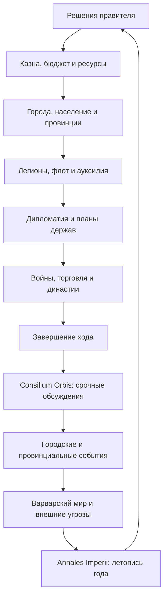
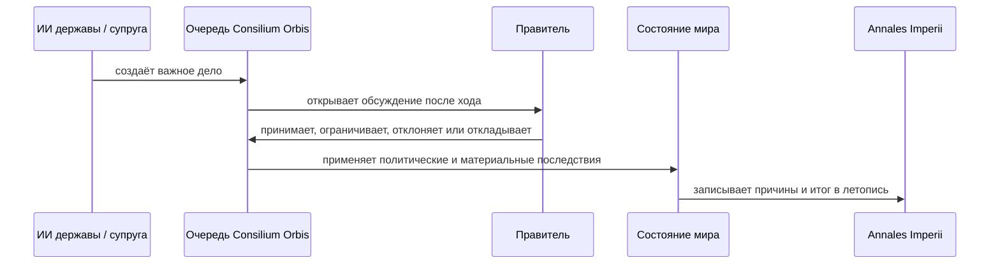
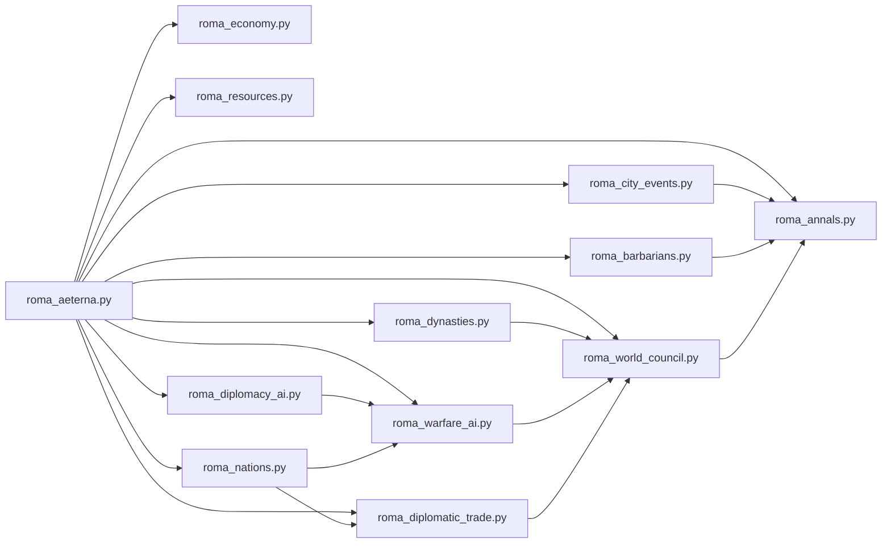

<h1 align="center">🏛 ROMA AETERNA</h1>

<p align="center">
<b>Grand Strategy • 4X • Historical Sandbox • Roman Republic & Empire</b>
</p>

<p align="center">

[](https://aqua666-prog.itch.io/roma-aeterna)
[](https://github.com/Aqua666-prog/Roma-Aeterna/actions/workflows/python-app.yml)
[](https://github.com/Aqua666-prog/Roma-Aeterna/actions/workflows/codeql.yml)


</p>

> *Hoc illud est praecipue in cognitione rerum salubre ac frugiferum, omnis te exempli documenta in inlustri posita monumento intueri.*
>
> **«Главная польза познания прошлого в том, что перед тобой, словно на ясном памятнике, открываются примеры всякого рода».**
>
> — **Тит Ливий, *Ab Urbe Condita*, Praefatio 10.**  
> Латинский оригинал находится в общественном достоянии; русский перевод выполнен специально для этого README.

---

## SPQR — держава в твоих руках

**Roma Aeterna** — текстовая историческая стратегия, в которой игрок получает не готовую империю, а противоречивую римскую государственность: Сенат и народ, легионы и флот, города и провинции, зерно и серебро, родовые союзы, варварские миграции, иностранные дворы, браки, заговоры и войны.

Игра не сводится к последовательности кнопок «построить» и «атаковать». Каждый ход создаёт новую политическую ситуацию. Успешная война может опустошить казну; выгодный брак — открыть рынки и одновременно привести ко двору чужую династию; хлебная раздача — спасти порядок, но лишить армию резерва; завоёванный город — стать опорой Рима либо очагом многолетнего сопротивления.

Здесь история понимается как **система взаимных причин**, а не как декоративный фон.

---

## Содержание

- [Текущая версия](#-текущая-версия)
- [Что это за игра](#-что-это-за-игра)
- [Четыре основания 4X](#-четыре-основания-4x)
- [Игровой цикл](#-игровой-цикл)
- [Главные механики](#-главные-механики)
- [Державы мира](#-державы-мира)
- [Династии и умная супруга](#-династии-и-умная-супруга)
- [Послеходовый Consilium Orbis](#-послеходовый-consilium-orbis)
- [Управление](#-управление)
- [Установка и запуск](#-установка-и-запуск)
- [Системные требования](#-системные-требования)
- [Сохранения и настройки](#-сохранения-и-настройки)
- [Структура проекта](#-структура-проекта)
- [Проверка и диагностика](#-проверка-и-диагностика)
- [Исторический метод и оговорки](#-исторический-метод-и-оговорки)
- [Разработка и вклад](#-разработка-и-вклад)
- [Источники эпиграфов](#-источники-эпиграфов)

---

## 🏷 Текущая версия

Этот README подготовлен для сборки **Roma Aeterna v2.90.0 — Gentes et Regna** с обновлённым модулем династий **Domus et Coniugia v1.1.0 — Consilium Reginae**.

| Компонент | Версия | Назначение |
|---|---:|---|
| Игровое ядро | `2.90.0-gentes-regna` | основной цикл, Рим и интеграция модулей |
| Roma Economica | `4` | макроэкономика и национальные счета |
| Opes Imperii | `1` | автоматическая ресурсная экономика |
| Civitates | `1.0.0-civitates` | города и провинциальные события |
| Orbis Politicus | `1.0.0-orbis-politicus` | стратегический ИИ держав |
| Gentes et Regna | `1.0.0-gentes-regna` | уникальные цивилизации |
| Bella Regnorum | `1.0.0-bella-regnorum` | прямые межгосударственные войны |
| Mercatura Gentium | `1.0.0-mercatura-gentium` | дипломатическая торговля |
| Domus et Coniugia | `1.1.0-consilium-reginae` | династии и развивающийся ИИ супруги |
| Consilium Orbis | `1.0.0-consilium-orbis` | послеходовая очередь важных решений |
| Barbaricum | `1.2.0-annales-bridge` | племена, миграции и федераты |
| Chronica Urbis | `2.0.1-chronica-urbis` | анналы и журнал причин |

---

## 🎮 Что это за игра

| Параметр | Описание |
|---|---|
| **Жанр** | историческая 4X-стратегия, государственный менеджмент, политическая симуляция |
| **Сеттинг** | Рим и Средиземноморье в авторской историко-стратегической хронологии |
| **Формат** | одиночная текстовая игра в терминале |
| **Движок** | Python 3, без обязательного графического окружения |
| **Интерфейс** | мобильный ANSI, Rich-панели и Textual-меню с безопасным откатом |
| **Темп** | пошаговый; один ход представляет очередной государственный год |
| **Главная роль игрока** | правитель и политический центр Рима |
| **Основная особенность** | важные последствия возникают автоматически после хода и развиваются через многоэтапные обсуждения |

Игрок создаёт собственную политическую сессию: выбирает имя, должность, род, фракцию, божество-покровителя, стиль власти, стратегический наказ, первый эдикт и меру суровости Фортуны.

Далее начинается борьба не только за территорию, но и за **связность государства**. Рим может победить внешнего врага и проиграть собственной экономике, Сенату, голоду, провинциальной ненависти или династическому кризису.

---

## 🧭 Четыре основания 4X

### Explore — исследовать

- получать разведывательные сведения о державах и варварском мире;
- наблюдать цели, страхи и долгосрочные планы иностранных ИИ;
- раскрывать лагеря, миграции, коалиции и подготовку войны;
- изучать торговые возможности, ресурсы и политические уязвимости соседей;
- читать летопись причин, а не только итоговых чисел.

### Expand — расширяться

- завоёвывать города и провинции;
- закреплять гарнизоны и проводить романизацию;
- выбирать режим управления покорёнными землями;
- восстанавливать разрушенное хозяйство;
- превращать завоевание в устойчивую систему дорог, городов, налогов и лояльности.

### Exploit — использовать

- развивать пять взаимосвязанных отраслей экономики;
- управлять налогами, тарифами, бюджетом, кредитом и денежным стандартом;
- добывать и перерабатывать 31 ресурс;
- заключать долгосрочные международные контракты;
- использовать уникальные товары и бонусы отдельных держав;
- удерживать баланс между армией, народом, провинциями и ростом.

### Exterminate — уничтожать или подчинять

- вести прямые войны против национальных армий;
- выбирать легионы, тактики и направления кампаний;
- отражать рейды, осады и варварские вторжения;
- доводить противника до контрибуции, торговых уступок или клиентского статуса;
- помнить, что полное уничтожение врага иногда обходится дороже разумного мира.

---

## 🔄 Игровой цикл



Ключевой принцип интерфейса: **игрок не обязан обходить каждое меню в поисках чрезвычайного события**. Самые важные войны, брачные посольства, торговые кризисы, советы супруги и мирные конференции попадают в очередь послеходового Совета держав.

---

# ⚙ Главные механики

## 🏙 Города и провинции — *Civitates et Provinciae*

Город — не безликая отметка на карте. Он обладает собственным состоянием:

- населением;
- процветанием;
- запасом продовольствия;
- порядком и лояльностью;
- культурной интеграцией;
- здоровьем;
- инфраструктурой;
- загрязнением;
- обороной;
- торговым потенциалом;
- временными эффектами и личной историей.

В отдельном каталоге содержатся **32 городских и провинциальных события**. Среди них:

- эпидемии и санитарные кризисы;
- пожары и землетрясения;
- голод и выдающийся урожай;
- коррупция наместника;
- налоговые волнения;
- пиратство и разбой;
- контрабанда;
- переселение ветеранов;
- религиозные конфликты;
- беженцы;
- ремонт стен;
- инженерные проекты;
- игры, празднества и общественные раздачи.

События предлагают несколько решений, требуют разных ресурсов и могут давать последствия на многие ходы. Политически удобный ответ не всегда экономически разумен, а дешёвое решение не всегда безопасно.

---

## 💰 Макроэкономика — *Roma Economica*

Экономическая система моделирует не один общий «доход», а связанное хозяйство.

### Пять производственных секторов

1. сельское хозяйство;
2. горное дело;
3. ремесло и мануфактуры;
4. строительство;
5. торговля и услуги.

Отрасли используют труд, капитал и продукцию друг друга. Нехватка металлов бьёт по ремеслу и стройкам; слабая торговля затрудняет сбыт; чрезмерные военные расходы вытесняют частные инвестиции.

### Государственные инструменты

- налоговая ставка;
- таможенный тариф;
- распределение бюджета между шестью ведомствами;
- бюджетная позиция: экономия, баланс, развитие или военная мобилизация;
- полновесная, управляемая или обесцененная монета;
- государственный долг и облигации;
- чеканка и инфляция;
- капитальные вложения;
- кредитная политика;
- отраслевые программы.

### Население и общество

Экономика учитывает свободное и рабское население, город и деревню, участие в труде, мобильность, урбанизацию, безработицу, смертность, рост и риск восстания рабов.

### Шоки

Эпидемии, климатические бедствия, аварии на рудниках, банковские паники, валютные кризисы и импортная зависимость способны разрушить даже внешне богатую державу.

---

## ⛏ Ресурсы — *Opes Imperii*

Провинции добывают ресурсы автоматически; хозяйство расходует их в ходе общего расчёта. Игрок принимает стратегические решения, а не нажимает «добыть железо» каждый год.

В каталоге присутствует **31 ресурс**, включая:

- пшеницу, вино, рыбу, скот и оливковое масло;
- древесину, камень, мрамор и соль;
- железо, медь, олово, свинец, серебро и золото;
- бронзу и сталь как производные материалы;
- лошадей;
- шерсть, лён и кожу;
- пурпур, благовония, специи, янтарь, папирус и шёлк.

Нехватка по возможности закрывается закупками, но зависимость от чужих поставок превращается в дипломатическую уязвимость.

---

## 🏛 Сенат, народ и внутренние фракции

Рим не является единой волей. Игрок балансирует между:

- Сенатом и знатными родами;
- народной поддержкой;
- военными интересами;
- купцами и кредиторами;
- религиозными институтами;
- провинциальными клиентелами;
- амбициозными политическими фракциями.

Внутренний ИИ способен наращивать влияние, создавать временные блоки и использовать слабость правителя. Высокая слава не отменяет необходимости платить армии, кормить город и сохранять auctoritas — признанный авторитет власти.

---

## ⚔ Легионы, осады и прямые войны

Римские легионы обладают качеством, численностью, моралью, опытом, командующим, усталостью и ограниченными очками действий. Один легион не может безнаказанно захватить половину мира за один ход.

Война включает:

- накопительный урон городским укреплениям;
- полевые сражения на системе 3d6;
- точный табличный прогноз вероятности;
- тактику игрока и контртактику ИИ;
- осады, рейды, снабжение и износ;
- выбор конкретного легиона;
- военную усталость;
- счёт войны;
- мирные конференции.

Иностранные армии формируются из **национальных частей**, а не из универсальных «врагов».

---

## ⛵ Флот и Средиземное море

Морская сила влияет на:

- защиту торговых путей;
- борьбу с пиратами;
- снабжение прибрежных кампаний;
- перевозку войск;
- морское давление на Карфаген, Египет и другие державы;
- стоимость и безопасность международной торговли.

Карфагенская талассократия, египетская нильская эскадра и римская classis воюют и мыслят по-разному.

---

## 🐺 Варварский мир — *Barbaricum*

За лимесом существует самостоятельная система племён:

- пять фронтиров;
- лагеря;
- набеги;
- миграции;
- конфедерации;
- дипломатия вождей;
- страх, давление и готовность;
- федераты;
- переселение народов.

Племена реагируют на силу Рима, патрули, подарки, поражения и бездействие. Небольшой лагерь, оставленный без внимания, способен превратиться в миграционный кризис.

---

## 📜 Летопись — *Annales Imperii / Chronica Urbis*

> *οὔτε γὰρ ἱστορίας γράφομεν, ἀλλὰ βίους.*
>
> **«Ибо мы пишем не истории, а жизни».**
>
> — **Плутарх, *Александр*, 1.2.** Собственный перевод с древнегреческого.

Летопись имеет два слоя:

- **анналы** — связный рассказ о ходе;
- **tabularium** — подробный технический журнал событий, причин, бросков и последствий.

Игра старается отвечать не только на вопрос **«что произошло?»**, но и на вопрос **«почему это произошло?»**. Военные, политические, экономические, религиозные, городские и дипломатические события объединяются в хронику правления.

---

# 🌍 Державы мира

В релизе **Gentes et Regna** шесть иностранных держав являются отдельными цивилизациями. Каждая имеет собственное правительство, идентичность, товары, дипломатию, военную доктрину, набор войск и уникальные выгоды от торговли, союза, брака либо клиентского статуса.

| Держава | Политическая модель | Исключительные товары | Характер войны | Примеры уникальных войск |
|---|---|---|---|---|
| **Карфаген** | торговая олигархия и морская талассократия | пурпур, благовония, серебро | флот, деньги, блокада, наёмники | Священный отряд, боевые слоны, пуническая квинкверема |
| **Нумидия** | подвижное конное царство | лошади, кожа, скот | рейды, разведка, высокая мобильность | нумидийские всадники, царская конная дружина |
| **Пергам** | учёная эллинистическая монархия | папирус, мрамор, вино | дисциплина, фаланга, инженеры | пергамская фаланга, галатская гвардия, царские инженеры |
| **Парфия** | аристократическая конная держава | лошади, специи, шёлк | дистанционный бой, манёвр, тяжёлая конница | конные лучники, катафракты, дружина азатов |
| **Египет** | дворцовая и храмовая монархия | пшеница, папирус, лён | ресурсы, флот, наёмные и дворцовые силы | махимои, царская агема, нильская эскадра |
| **Галльская конфедерация** | союз племён, знати и друидов | железо, вино, янтарь | массовая мобилизация, лесные засады, конфедерации | гезаты, конница знати, стража друидов, колесницы |

### Стратегический ИИ держав — *Orbis Politicus*

Каждая держава обладает собственными параметрами:

- казной и резервами;
- стабильностью;
- военной готовностью;
- экономической, морской и дипломатической мощью;
- агрессивностью;
- осторожностью;
- честолюбием;
- верностью договорам;
- памятью о действиях Рима;
- краткосрочной целью;
- многоходовым стратегическим планом.

ИИ способен создавать коалиции, заключать и разрывать соглашения, готовить войны, предъявлять ультиматумы, расширять торговое влияние, проводить шпионаж, искать римское покровительство или формировать антиримский блок.

---

## 🤝 Международная торговля — *Mercatura Gentium*

Крупный договор проходит несколько стадий:

1. посольство и первоначальное предложение;
2. обсуждение товара и направления поставок;
3. торг о цене, объёме и сроке;
4. встречное предложение;
5. ратификация;
6. исполнение по ходам;
7. продление, реструктуризация, спор или разрыв.

Договоры могут приводить к задолженности, приостановке поставок и международному кризису. Во время войны торговые отношения меняются не декоративно, а материально: исчезнувший импорт зерна или лошадей способен изменить всю кампанию.

---

## 👑 Династии и умная супруга

Модуль **Domus et Coniugia** моделирует иностранные царские дома, брачные посольства, наследников и политическую жизнь супруги.

### Династический брак

Переговоры проходят поэтапно:

1. публичная аудиенция послов;
2. досье кандидатки;
3. оценка политической цены;
4. личная беседа;
5. окончательная клятва;
6. изменение отношений между государствами.

В игре есть **12 уникальных кандидаток** из шести держав. У каждой собственные:

- имя и династический дом;
- характерные черты;
- интеллект;
- дипломатия;
- интрига;
- управление;
- амбиция;
- сострадание;
- верность родине;
- личный вопрос к будущему супругу.

### Супруга как ИИ-персонаж

После брака женщина не превращается в строку «+10% к дипломатии». Она:

- анализирует казну, зерно, войны, Сенат и народ;
- следит за отношениями с родной державой;
- выбирает собственную политическую повестку;
- просит посредничества, торговли, помощи народу или своему дому;
- предлагает казённые реформы и военные планы;
- раскрывает заговоры;
- добивается права влиять на Сенат;
- поднимает вопрос о наследнике;
- помнит согласия, компромиссы, отказы и унижения.

### Развитие интеллекта — *Consilium Reginae*

Интеллект супруги развивается в процессе игры. Система учитывает:

- образование;
- мудрость;
- политический опыт;
- участие в реальных государственных решениях;
- успешные дипломатические, военные, административные и тайные миссии;
- многоэтапные программы обучения.

Супруга может создать при дворе:

- философскую школу;
- школу риторики и языков;
- школу управления;
- сеть изучения тайной политики;
- военно-политическую школу стратегии.

Чем выше навык, тем больше опыта требуется для дальнейшего роста.

### Беспрекословное доверие и скрытые эффекты

Если правитель последовательно принимает и **фактически исполняет** советы супруги, игра отслеживает непрерывную серию согласий и скрытый показатель доверительного послушания. Невыполнимое решение не засчитывается как полноценное согласие.

По мере роста интеллекта, мудрости, доверия и влияния открываются четыре ступени:

1. **Тихое влияние**;
2. **Consilium Reginae — Совет супруги**;
3. **Concordia Domus — Согласие правящего дома**;
4. **Imperium Duplex — Двуединая власть**.

Точные числовые эффекты сознательно не раскрываются в интерфейсе. Игрок видит политический результат: более последовательное управление, укрепление казны и науки, снижение волнений, улучшение морали и репутации.

Компромисс замедляет развитие незримого влияния. Отказ, игнорирование или истечение аудиенции прерывает серию.

### Наследники

Рождение наследника создаёт новую династическую реальность. Учитываются мать, дом, ход рождения и легитимность. Интеллект и политическое положение матери влияют на устойчивость правящего дома.

---

## 🏛 Послеходовый Consilium Orbis

**Consilium Orbis** — центральная очередь важных международных и династических событий.

После завершения хода автоматически могут открыться:

- объявление войны;
- предложение мира;
- военное донесение;
- торговое посольство;
- спор по действующему договору;
- брачное предложение;
- личная аудиенция супруги;
- школа супруги;
- усиление её незримой власти;
- международный ультиматум;
- коалиционный кризис.

Каждое дело имеет:

- уровень важности;
- срок рассмотрения;
- защиту от повторов;
- возможность отложить ответ;
- последствия молчаливого отказа;
- запись в архив Совета.



---

# 🎛 Управление

Главное меню доступно с клавиатуры. В Textual-режиме пункты также нажимаются мышью или касанием.

| Клавиша | Раздел | Назначение |
|---:|---|---|
| `1` | Провинции | захват, гарнизоны, романизация |
| `M` | Города и муниципии | население, порядок, здоровье и история городов |
| `2` | Легионы | найм, обучение, генералы и состояние армии |
| `4` | Завершить ход | расчёт следующего года и автоматические события |
| `V` | Условия победы | прогресс кампании |
| `N` | Летопись Империи | анналы, причины и технический журнал |
| `P` | Сенат и роды | партии, роды, реформы и внутренняя политика |
| `D` | Религия | вера, культы, институты и события |
| `C` | Советник Республики | анализ экономики, войны и победы |
| `5` | Экономика | бюджет, рынок, ресурсы и национальные счета |
| `F` | Флот | корабли, морская сила, пираты |
| `6` | Внешняя политика | доктрина, миссии, кризисы и договоры |
| `I` | Стратегический ИИ держав | планы, коалиции, угрозы и контрразведка |
| `G` | Державы, войны и династии | цивилизации, прямые войны, торговля, брак и Совет держав |
| `7` | Наука и стройки | технологии, исследования и строительство |
| `A` | Ауксилия | вспомогательные войска |
| `B` | Варварский мир | племена, лагеря, миграции и федераты |
| `T` | Артиллерия | осадные орудия |
| `L` | Великие люди | персонажи, цитаты и бонусы |
| `W` | Чудеса света | великие постройки |
| `Y` | Пророчества | периодические знамения |
| `Z` | Вражеский штаб | разведка, вражеские армии, рейды и осады |
| `8` | Лог событий | последние известия |
| `S` | Сохранить | ручное сохранение партии |
| `Q` | Выход | завершить игру |

> **Главная клавиша игры — `4`.** Именно завершение хода запускает экономику, ИИ, войны, торговлю, династии, городской слой и послеходовые обсуждения.

---

# 📦 Установка и запуск

## Быстрый запуск

1. Скачайте архив игры.
2. Распакуйте **все файлы в одну папку**.
3. Откройте терминал в этой папке.
4. Запустите:

```bash
python roma_aeterna.py
```

На некоторых системах команда называется:

```bash
python3 roma_aeterna.py
```

## Windows

```powershell
cd C:\Games\Roma-Aeterna
py roma_aeterna.py
```

Для расширенного интерфейса:

```powershell
py -m pip install rich textual pillow
py roma_aeterna.py
```

## Linux / macOS

```bash
cd ~/Games/Roma-Aeterna
python3 roma_aeterna.py
```

Опциональные библиотеки:

```bash
python3 -m pip install rich textual pillow
```

## Android — Pydroid 3

1. Распакуйте архив в отдельную папку.
2. Не выносите `roma_aeterna.py` из папки с модулями.
3. Откройте основной файл в Pydroid 3.
4. Нажмите **Run**.
5. При желании установите через Pip:

```text
rich
textual
pillow
```

`lupa` на Android не обязательна. При её отсутствии игра использует встроенные Python-данные.

## Android — Termux

```bash
pkg update
pkg install python
termux-setup-storage
cd ~/storage/downloads/Roma-Aeterna
python roma_aeterna.py
```

Для улучшенного интерфейса:

```bash
pip install rich textual pillow
```

---

## 🖥 Системные требования

### Минимальные

- Python **3.10 или новее**;
- терминал с поддержкой UTF-8;
- все игровые `.py`-файлы в одной папке;
- возможность записи в папку игры для сохранений и логов.

### Рекомендуемые

- терминал шириной от 80 символов;
- шрифт с кириллицей и Unicode-рамками;
- `rich` для таблиц и панелей;
- `textual` для полноэкранного меню;
- `Pillow` для терминального показа изображений;
- `lupa` только при использовании внешнего Lua-контента.

### Обязательные зависимости

**Нет.** Игра сохраняет работоспособность на стандартной библиотеке Python. Опциональные библиотеки улучшают внешний вид или открывают дополнительные способы загрузки контента.

---

## 🧱 Интерфейс

Игра использует каскад безопасного отката:

```text
Textual → Rich → ANSI / обычный print
```

Если Textual или Rich не установлены, партия не должна падать. Игра переключается на более простой интерфейс, сохраняя ключевые функции.

### Почему рамки иногда выглядят неровно

Терминалы по-разному считают ширину эмодзи и восточноазиатских символов. В игре есть мобильный расчёт визуальной ширины, однако результат всё ещё зависит от шрифта и приложения.

Для лучшего вида:

- используйте моноширинный шрифт;
- увеличьте ширину терминала;
- уменьшите системный масштаб текста;
- при проблемах отключите сложный интерфейс и используйте ANSI-режим.

---

# 💾 Сохранения и настройки

Все служебные файлы создаются рядом с `roma_aeterna.py`.

| Файл | Назначение |
|---|---|
| `roma_savegame.json` | основное сохранение |
| `roma_savegame.json.bak` | резервная копия сохранения |
| `roma_settings.json` | пользовательские настройки и баланс |
| `roma_debug.log` | диагностический журнал с ротацией |
| `roma_crash.log` | сведения о необработанных падениях |
| `roma_integrity.sha256` | локальная проверка целостности, если создана игрой |

### Автосохранение

По умолчанию игра периодически создаёт автоматическое сохранение. Интервал можно изменить в `roma_settings.json`.

### Перенос партии

Для переноса на другое устройство скопируйте:

```text
roma_savegame.json
roma_savegame.json.bak
```

в папку новой установки.

### Совместимость старых сохранений

Новые модули используют собственные сериализуемые состояния и функции миграции. При загрузке старой партии отсутствующие городские, дипломатические, военные, торговые и династические данные создаются автоматически.

Перед крупным обновлением всё равно рекомендуется сохранить отдельную копию `roma_savegame.json`.

---

# 🗂 Структура проекта

```text
Roma-Aeterna/
├── roma_aeterna.py              # основной игровой цикл, Рим, меню и базовые системы
├── roma_economy.py              # макроэкономика, бюджет, отрасли, демография и кредит
├── roma_resources.py            # автоматическая ресурсная экономика
├── roma_city_events.py          # живые города и каталог городских событий
├── roma_diplomacy_ai.py         # стратегический ИИ держав и международные планы
├── roma_nations.py              # уникальные цивилизации, товары, бонусы и войска
├── roma_warfare_ai.py           # прямые межгосударственные войны и фронты
├── roma_diplomatic_trade.py     # долгосрочная международная торговля
├── roma_dynasties.py            # браки, наследники и интеллектуальный ИИ супруги
├── roma_world_council.py        # послеходовый Consilium Orbis
├── roma_barbarians.py           # племена, лагеря, миграции, конфедерации и федераты
├── roma_annals.py               # анналы и техническая хроника
├── roma_textual_menu.py         # внешний Textual-интерфейс с безопасным откатом
├── roma_settings.json           # настройки, создаётся или обновляется игрой
├── roma_savegame.json           # сохранение, появляется после игры
└── README.md                    # этот документ
```

## Архитектурный принцип

Крупные подсистемы не импортируют `roma_aeterna.py`. Основной файл передаёт им:

- объект `player`;
- небольшой словарь `ctx` с функциями и ссылками на соседние модули.

Типичный публичный контракт:

```python
ensure_state(player, ctx)
process_turn(player, ctx)
open_menu(player, ctx)
```

Такой подход:

- уменьшает риск циклических импортов;
- упрощает тестирование;
- позволяет отключить повреждённый необязательный модуль без падения всей партии;
- сохраняет сериализуемость состояний;
- делает дальнейшее дробление проекта безопаснее.



---

# 🧪 Проверка и диагностика

## Встроенная самопроверка

```bash
python roma_aeterna.py --self-test
```

Успешный результат:

```text
SELF-TEST ROMA AETERNA
✅ Критических ошибок не найдено.
```

Предупреждение об отсутствии `lupa` не является критической ошибкой: встроенные данные Python остаются доступными.

## Компиляционная проверка всех модулей

### Linux / macOS / Termux

```bash
python -m py_compile *.py
```

### Windows PowerShell

```powershell
Get-ChildItem *.py | ForEach-Object { py -m py_compile $_.Name }
```

## Если игра не запускается

### `ModuleNotFoundError: roma_...`

Почти всегда один из модулей отсутствует или лежит в другой папке. Распакуйте архив заново и убедитесь, что `roma_aeterna.py` находится рядом со всеми `roma_*.py`.

### `Textual недоступен`

Это не фатальная ошибка. Установите:

```bash
python -m pip install textual rich
```

либо продолжайте в классическом интерфейсе.

### `lupa не найдена`

Это нормальный режим. Lua-контент будет пропущен, а игра возьмёт встроенные данные.

### Сохранение не записывается

Проверьте, что терминал или Pydroid имеет разрешение записи в папку игры. Не запускайте проект непосредственно из защищённого архива.

### Неожиданное падение

Приложите к сообщению об ошибке:

- текст исключения;
- `roma_crash.log`;
- последние строки `roma_debug.log`;
- версию Python;
- название платформы;
- шаги, после которых произошёл сбой.

Не публикуйте сохранение, если в нём есть данные, которыми вы не хотите делиться.

---

# 🏺 Исторический метод и оговорки

Roma Aeterna — **исторически вдохновлённая стратегия**, а не академическая реконструкция одного строго определённого года.

Проект сознательно соединяет:

- республиканские и имперские политические мотивы;
- реалии разных этапов средиземноморской истории;
- исторические народы, дома, войска и институты;
- условные экономические величины;
- альтернативно-исторические браки и союзы;
- игровые обобщения, необходимые для баланса.

Названия частей, должностей, товаров и политических практик используются для создания исторической логики, но не гарантируют абсолютной синхронности всех элементов.

### Как читать игру исторически

Лучший способ — воспринимать её как **контрфактическую модель**: *что могло бы произойти, если определённые институты, ресурсы, личности и кризисы оказались связаны иначе?*

Игра не заменяет источниковедение, археологию или научную литературу. Она предлагает пространство для исторического мышления: причинности, ограничений, побочных последствий и конфликта между намерением правителя и инерцией общества.

---

# 🛠 Разработка и вклад

Проект находится в активной разработке. Особенно полезны:

- воспроизводимые сообщения об ошибках;
- проверка старых сохранений;
- предложения по балансу;
- новые городские события;
- новые державы и уникальные военные доктрины;
- улучшения мобильного интерфейса;
- исторические комментарии со ссылками на источники;
- тесты отдельных модулей.

## Рекомендации для новых модулей

1. Не импортировать основной файл.
2. Принимать `player` и `ctx`.
3. Хранить состояние только в JSON-сериализуемых структурах.
4. Иметь функцию `ensure_state()` для миграции старых сейвов.
5. Перехватывать необязательные интерфейсные ошибки.
6. Записывать важные последствия в `Annales Imperii`.
7. Отправлять ключевые послеходовые решения в `Consilium Orbis`.
8. Не создавать параллельную систему для уже существующей механики.

## Перед публикацией изменения

```bash
python -m py_compile *.py
python roma_aeterna.py --self-test
```

После этого рекомендуется провести не менее десяти неинтерактивных ходов и проверить сохранение с повторной загрузкой.

---

# 🗺 Возможные направления развития

Это не обещание конкретных сроков, а перечень естественных направлений проекта:

- пространственная карта с разведкой и туманом войны;
- более глубокое строительство отдельных городов;
- международные войны между ИИ без участия Рима;
- воспитание и взросление наследников;
- придворные фракции и советники;
- расширение исторических держав;
- сценарные кампании;
- локализация;
- отдельный графический клиент поверх существующего Python-ядра;
- дальнейший перенос контента из кода в внешние файлы данных.

---

# 📚 Источники эпиграфов

Античные тексты находятся в общественном достоянии. Русские переводы в этом README выполнены заново и не копируют современные коммерческие издания.

1. **Titus Livius.** *Ab Urbe Condita*, Praefatio 10.  
   Латинский текст: [The Latin Library](https://www.thelatinlibrary.com/livy/liv.pr.shtml).

2. **Plutarchus.** *Alexander*, 1.2.  
   Древнегреческий текст: [Perseus / Scaife Viewer](https://scaife.perseus.org/reader/urn:cts:greekLit:tlg0007.tlg047.perseus-grc2:1.2/).

---

<div align="center">

## **SENATUS · LEGIONES · PROVINCIAE · AURUM**

**Рим не становится вечным сам по себе. Его вечность — это решение, принимаемое каждый ход.**

```text
Senatus deliberat.
Populus expectat.
Legiones vigilant.
Fortuna tacet.
```

</div>
