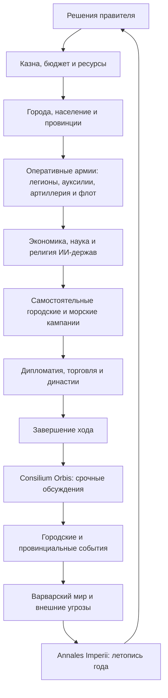
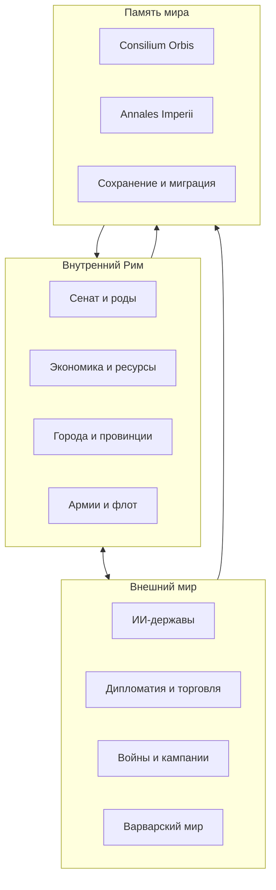
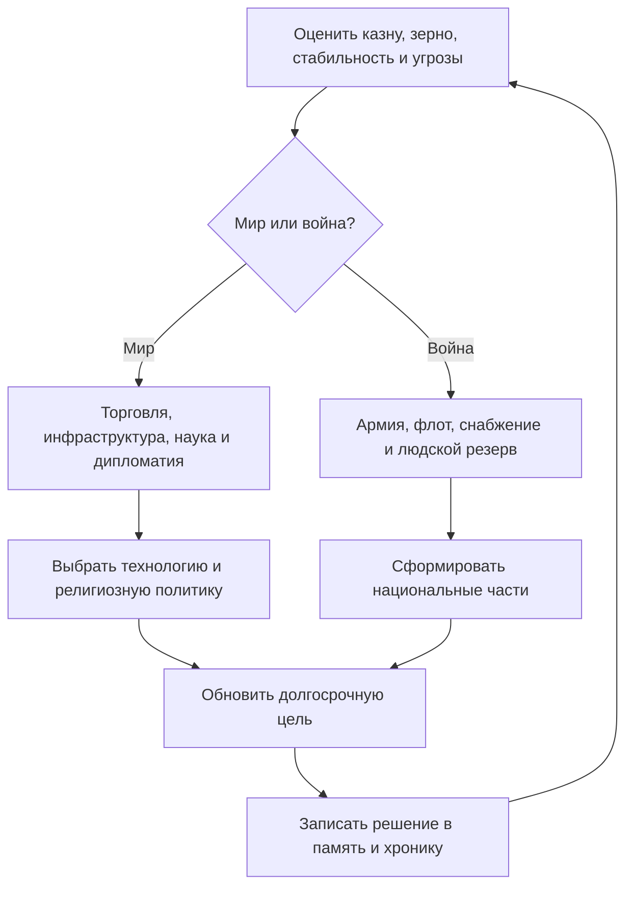
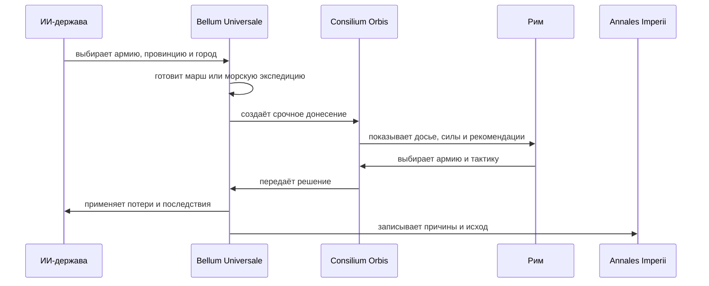
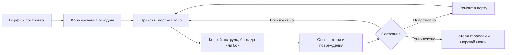
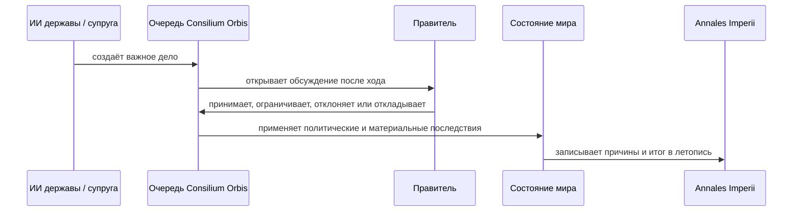
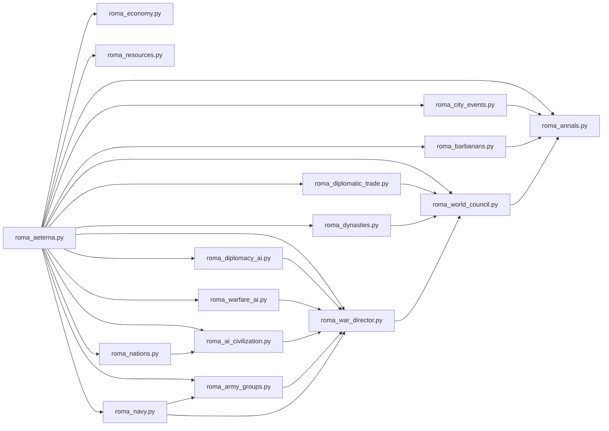

<div align="center">

<pre>
╔══════════════════════════════════════════════════════════════╗
║                         S  P  Q  R                           ║
║                                                              ║
║                     R O M A  A E T E R N A                   ║
║                                                              ║
║       SENATUS · LEGIONES · PROVINCIAE · MARE · AURUM        ║
╚══════════════════════════════════════════════════════════════╝
</pre>

# 🏛 ROMA AETERNA

### **IMPERIUM VIVUM**

#### *Exercitus · Mare Nostrum · Civitates Artificiales · Bellum Universale*

**Большая историческая 4X-стратегия о Риме — в терминале, на чистом Python.**

[](#-системные-требования)
[](#-текущая-версия)
[](#-быстрый-старт)
[](#-четыре-основания-4x)
[](#-интерфейс)
[](#-установка-и-запуск)
[](#-архитектура-проекта)
[](#-путь-разработки)

[**🎮 itch.io**](https://aqua666-prog.itch.io/roma-aeterna)
&nbsp;·&nbsp;
[**📦 Быстрый старт**](#-быстрый-старт)
&nbsp;·&nbsp;
[**🗺 ROADMAP**](#-roadmap)
&nbsp;·&nbsp;
[**🧪 Самопроверка**](#-проверка-и-диагностика)

</div>

> *Hoc illud est praecipue in cognitione rerum salubre ac frugiferum, omnis te exempli documenta in inlustri posita monumento intueri.*
>
> **«Главная польза познания прошлого в том, что перед тобой, словно на ясном памятнике, открываются примеры всякого рода».**
>
> — **Тит Ливий, *Ab Urbe Condita*, Praefatio 10.**  
> Латинский оригинал находится в общественном достоянии; русский перевод выполнен специально для этого README.

---

## SPQR — держава в твоих руках

**Roma Aeterna** — текстовая историческая стратегия, в которой игрок получает не готовую империю, а противоречивую римскую государственность: Сенат и народ, легионы и флот, города и провинции, зерно и серебро, родовые союзы, варварские миграции, иностранные дворы, браки, заговоры и войны.

Игра не сводится к последовательности кнопок «построить» и «атаковать». Каждый ход создаёт новую политическую ситуацию. Успешная война может опустошить казну; выгодный брак — открыть рынки и одновременно привести ко двору чужую династию; хлебная раздача — спасти порядок, но лишить армию резерва; завоёванный город — стать опорой Рима либо очагом многолетнего сопротивления.

Здесь история понимается как **система взаимных причин**, а не как декоративный фон.

---

## Содержание

- [SPQR — держава в твоих руках](#spqr--держава-в-твоих-руках)
- [Текущая версия](#-текущая-версия)
- [Путь разработки](#-путь-разработки)
- [Что это за игра](#-что-это-за-игра)
- [Атлас механик](#-атлас-механик)
- [Четыре основания 4X](#-четыре-основания-4x)
- [Игровой цикл](#-игровой-цикл)
- [Главные механики](#-главные-механики)
- [Города и провинции](#-города-и-провинции--civitates-et-provinciae)
- [Экономика и ресурсы](#-макроэкономика--roma-economica)
- [Сенат и внутренняя политика](#-сенат-народ-и-внутренние-фракции)
- [Exercitus — оперативные армии](#-армии-нового-типа--exercitus)
- [Автономные ИИ-цивилизации](#-автономные-ии-цивилизации)
- [Bellum Universale](#-bellum-universale)
- [Mare Nostrum](#-самостоятельная-морская-война)
- [Варварский мир](#-варварский-мир--barbaricum)
- [Летопись](#-летопись--annales-imperii--chronica-urbis)
- [Державы мира](#-державы-мира)
- [Международная торговля](#-международная-торговля--mercatura-gentium)
- [Династии и умная супруга](#-династии-и-умная-супруга)
- [Consilium Orbis](#-послеходовый-consilium-orbis)
- [Управление](#-управление)
- [Установка и запуск](#-установка-и-запуск)
- [Сохранения и настройки](#-сохранения-и-настройки)
- [Архитектура проекта](#-структура-проекта)
- [Проверка и диагностика](#-проверка-и-диагностика)
- [Исторический метод](#-исторический-метод-и-оговорки)
- [Разработка и вклад](#-разработка-и-вклад)
- [ROADMAP](#-roadmap)
- [Источники эпиграфов](#-источники-эпиграфов)

---

## 🏷 Текущая версия

Этот README подготовлен для **Roma Aeterna v3.0.1 — Imperium Vivum / Mare Nostrum Fix**. Релиз завершает переход от войны одиночными легионами к операциям полноценных армий и превращает иностранные государства в автономные цивилизации, способные самостоятельно развивать хозяйство, науку, религию, сухопутные силы и флот.

| Компонент | Версия | Назначение |
|---|---:|---|
| Игровое ядро | `3.0.1-mare-nostrum-fix` | основной цикл, Рим, сейвы и исправление рекурсии флота/экономики |
| Exercitus Romanus | `3.0.0-exercitus` | оперативные армии из легионов, ауксилий, артиллерии и эскадр |
| Mare Nostrum Core | `3.0.1-mare-nostrum-core` | отдельное состояние флота, содержание и совместимость старых сейвов |
| Civitates Artificiales | `3.0.0-civitates-artificiales` | экономика, исследования, религия, набор войск и флот ИИ |
| Bellum Universale | `3.0.0-bellum-universale` | самостоятельные городские и морские кампании держав |
| Consilium Orbis | `1.0.0-consilium-orbis` | многоэтапные послеходовые решения и навязанные сражения |
| Roma Economica | `4` | макроэкономика и национальные счета Рима |
| Opes Imperii | `1` | автоматическая ресурсная экономика |
| Civitates | `1.0.0-civitates` | города и провинциальные события |
| Orbis Politicus | `1.0.0-orbis-politicus` | дипломатические цели, планы и память держав |
| Gentes et Regna | `1.0.0-gentes-regna` | уникальные цивилизации, товары и национальные ростеры |
| Bella Regnorum | `1.0.0-bella-regnorum` | договоры войны, счёт войны и мирные условия |
| Mercatura Gentium | `1.0.0-mercatura-gentium` | дипломатическая торговля |
| Domus et Coniugia | `1.1.0-consilium-reginae` | династии и развивающийся ИИ супруги |
| Barbaricum | `1.2.0-annales-bridge` | племена, миграции и федераты |
| Chronica Urbis | `2.0.1-chronica-urbis` | анналы и журнал причин |

### Что принципиально изменилось в 3.0

1. **Легион перестал быть изолированной армией.** Он входит в оперативное соединение вместе с другими легионами, ауксилиями, артиллерией и приданными кораблями.
2. **Иностранные государства получили собственный цикл воспроизводства.** Они собирают налоги, содержат резервы, распределяют бюджет, строят национальные части, осадные парки и эскадры.
3. **ИИ исследует то же древо технологий, что и Рим.** Знание применяется в национальной форме и влияет на производство, сражения, осады и море.
4. **ИИ может менять государственную религию.** Торговля, союз, брак и длительный культурный контакт создают давление обращения; религиозный перелом влияет на стабильность и военную мораль.
5. **Враг сам начинает кампанию.** Он выбирает конкретную провинцию, город, сухопутный маршрут либо морскую зону, после чего навязывает Риму полевое или морское сражение.
6. **Отказ от боя имеет материальные последствия.** Без ответа Рима возникают блокады, высадки, оккупация городов и, после повторных поражений, потеря провинции.
7. **Старые сохранения мигрируют автоматически.** Прежние легионы раскладываются по новым соединениям, а отсутствующие состояния ИИ создаются при загрузке.

---

# 🛤 Путь разработки

Roma Aeterna начиналась не как готовый «движок большой стратегии», а как один растущий Python-файл, в котором постепенно соединялись меню, экономика, легионы, провинции и события. Почти каждая крупная система родилась из практической проблемы, обнаруженной во время настоящей игры на телефоне.


| Этап | Что изменилось |
|---|---|
| **Ранний прототип** | сформировался базовый цикл: правитель, казна, зерно, провинции, легионы и завершение хода |
| **Мобильная эпоха** | интерфейс был перестроен под узкий экран Android, крупные кнопки и безопасный ANSI-режим |
| **v2.80 — Civitates et Orbis** | города получили постоянное состояние и события; иностранные державы — память, цели и стратегические планы |
| **v2.90 — Gentes et Regna** | появились полноценные цивилизации, национальные ростеры, прямые войны, международные контракты, династии и Consilium Orbis |
| **v3.0 — Imperium Vivum** | легионы были объединены в оперативные армии; державы получили собственные экономики, исследования, религии, сухопутные силы и инициативу в войне |
| **v3.0.1 — Mare Nostrum Fix** | флот был вынесен в отдельный модуль, разорван цикл экономики и содержания эскадр, проведена миграция старых сохранений |

## Авторский и AI-assisted путь

Проект разрабатывался **итеративно и под авторским руководством**. Концепции, историческая логика, структура механик, баланс, приоритеты и финальные решения определялись автором проекта. Несколько ИИ-инструментов использовались как помощники для генерации заготовок, ревью, рефакторинга и поиска ошибок.

Ключевая часть разработки происходила не в абстрактной лаборатории, а в цикле:

```text
идея → код → запуск на телефоне → реальная партия → найденный баг
     → переработка архитектуры → повторный тест → новая система
```

Поэтому Roma Aeterna хранит следы собственного роста: старые интерфейсы получают совместимые мосты, состояния мигрируют, а крупные механики постепенно выносятся из монолита в самостоятельные модули.

> **Roma Aeterna — авторская игра, созданная человеком с применением ИИ как инструмента разработки, а не игра, автоматически «сгенерированная нейросетью».**


---

## 🎮 Что это за игра

| Параметр | Описание |
|---|---|
| **Жанр** | историческая 4X-стратегия, государственный менеджмент, политическая симуляция |
| **Сеттинг** | Рим и Средиземноморье в авторской историко-стратегической хронологии |
| **Формат** | одиночная текстовая игра в терминале |
| **Движок** | Python 3, без обязательного графического окружения |
| **Интерфейс** | мобильный ANSI, Rich-панели и Textual-меню с безопасным откатом |
| **Темп** | пошаговый; один ход представляет очередной государственный год |
| **Главная роль игрока** | правитель и политический центр Рима |
| **Основная особенность** | важные последствия возникают автоматически после хода и развиваются через многоэтапные обсуждения |

Игрок создаёт собственную политическую сессию: выбирает имя, должность, род, фракцию, божество-покровителя, стиль власти, стратегический наказ, первый эдикт и меру суровости Фортуны.

Далее начинается борьба не только за территорию, но и за **связность государства**. Рим может победить внешнего врага и проиграть собственной экономике, Сенату, голоду, провинциальной ненависти или династическому кризису.

---

## 🧩 Атлас механик

| Сфера | Система | Что моделируется |
|---|---|---|
| 👤 Правитель | стартовая регистрация | имя, должность, род, фракция, покровитель, стиль власти, эдикт и сложность |
| 🏛 Политика | Сенат и роды | auctoritas, репутация, интересы знати, народная поддержка и внутренние фракции |
| 🏙 Территории | города и провинции | население, порядок, здоровье, инфраструктура, лояльность, романизация, гарнизоны и местные события |
| 💰 Хозяйство | Roma Economica | отрасли, труд, капитал, кредит, банки, бюджет, долг, тарифы, инфляция и национальные счета |
| ⛏ Снабжение | Opes Imperii | добыча, производство, дефициты, импорт и стратегические ресурсы |
| 🔬 Развитие | технологии | предпосылки, очки науки, эффекты открытий и внешние Lua-данные |
| 🕯 Вера | религии | государственный культ, вера, обращение, рвение, стабильность и политические последствия |
| ⚔ Армия | Legiones / Exercitus | легионы, командиры, ауксилии, артиллерия, доктрины, снабжение и оперативные армии |
| ⚓ Море | Mare Nostrum | эскадры, порты, маршруты, повреждения, морская пехота, транспорты, содержание и блокада |
| 🌍 Внешний мир | Orbis Politicus | характер держав, память, страхи, цели, долгосрочные планы и межгосударственные отношения |
| 🧠 ИИ-цивилизации | Civitates Artificiales | казна, зерно, долг, бюджет, исследования, религия, армия и флот каждой державы |
| 🗡 Война | Bella Regnorum | фронты, счёт войны, усталость, мирные условия и клиентские царства |
| 🗺 Кампании | Bellum Universale | выбор города, марш, высадка, навязанные битвы и последствия отказа |
| 🤝 Торговля | Mercatura Gentium | объём, цена, срок, задолженность, встречные предложения, споры и расторжение |
| 👑 Династии | Domus et Coniugia | иностранные дома, брак, супруга-агент, доверие, влияние, наследники и память |
| 🐺 Пограничье | Barbaricum | лагеря, набеги, миграции, конфедерации, вожди, федераты и давление на лимес |
| 📜 Память | Annales Imperii | литературная летопись, технический журнал, причины, броски и последствия |
| 🏛 Решения | Consilium Orbis | единая очередь кризисов, многоэтапные советы, отсрочка и последствия молчания |
| 💾 Надёжность | сейвы и миграции | JSON-состояния, резервные копии, восстановление старых партий и контроль целостности |
| 🖥 Интерфейс | ANSI / Rich / Textual | работа на ПК и Android с безопасным откатом без обязательной графики |


---

## 🧭 Четыре основания 4X

### Explore — исследовать

- получать разведывательные сведения о державах и варварском мире;
- наблюдать цели, страхи и долгосрочные планы иностранных ИИ;
- раскрывать лагеря, миграции, коалиции и подготовку войны;
- изучать торговые возможности, ресурсы и политические уязвимости соседей;
- читать летопись причин, а не только итоговых чисел.

### Expand — расширяться

- завоёвывать города и провинции;
- закреплять гарнизоны и проводить романизацию;
- выбирать режим управления покорёнными землями;
- восстанавливать разрушенное хозяйство;
- превращать завоевание в устойчивую систему дорог, городов, налогов и лояльности.

### Exploit — использовать

- развивать пять взаимосвязанных отраслей экономики;
- управлять налогами, тарифами, бюджетом, кредитом и денежным стандартом;
- добывать и перерабатывать 31 ресурс;
- заключать долгосрочные международные контракты;
- использовать уникальные товары и бонусы отдельных держав;
- удерживать баланс между армией, народом, провинциями и ростом.

### Exterminate — уничтожать или подчинять

- вести прямые войны против развивающихся национальных армий;
- собирать оперативные армии из легионов, ауксилий, артиллерии и флота;
- выбирать соединение, доктрину и способ принять навязанный бой;
- отражать рейды, осады и варварские вторжения;
- доводить противника до контрибуции, торговых уступок или клиентского статуса;
- помнить, что полное уничтожение врага иногда обходится дороже разумного мира.

---

## 🔄 Игровой цикл



Ключевой принцип интерфейса: **игрок не обязан обходить каждое меню в поисках чрезвычайного события**. Самые важные войны, брачные посольства, торговые кризисы, советы супруги и мирные конференции попадают в очередь послеходового Совета держав.

### Три слоя живого мира



Каждое решение проходит через все три слоя: меняет внутреннее состояние, вызывает реакцию мира и остаётся в летописи или памяти ИИ.


---

# ⚙ Главные механики

## 🏙 Города и провинции — *Civitates et Provinciae*

Город — не безликая отметка на карте. Он обладает собственным состоянием:

- населением;
- процветанием;
- запасом продовольствия;
- порядком и лояльностью;
- культурной интеграцией;
- здоровьем;
- инфраструктурой;
- загрязнением;
- обороной;
- торговым потенциалом;
- временными эффектами и личной историей.

В отдельном каталоге содержатся **32 городских и провинциальных события**. Среди них:

- эпидемии и санитарные кризисы;
- пожары и землетрясения;
- голод и выдающийся урожай;
- коррупция наместника;
- налоговые волнения;
- пиратство и разбой;
- контрабанда;
- переселение ветеранов;
- религиозные конфликты;
- беженцы;
- ремонт стен;
- инженерные проекты;
- игры, празднества и общественные раздачи.

События предлагают несколько решений, требуют разных ресурсов и могут давать последствия на многие ходы. Политически удобный ответ не всегда экономически разумен, а дешёвое решение не всегда безопасно.

---

## 💰 Макроэкономика — *Roma Economica*

Экономическая система моделирует не один общий «доход», а связанное хозяйство.

### Пять производственных секторов

1. сельское хозяйство;
2. горное дело;
3. ремесло и мануфактуры;
4. строительство;
5. торговля и услуги.

Отрасли используют труд, капитал и продукцию друг друга. Нехватка металлов бьёт по ремеслу и стройкам; слабая торговля затрудняет сбыт; чрезмерные военные расходы вытесняют частные инвестиции.

### Государственные инструменты

- налоговая ставка;
- таможенный тариф;
- распределение бюджета между шестью ведомствами;
- бюджетная позиция: экономия, баланс, развитие или военная мобилизация;
- полновесная, управляемая или обесцененная монета;
- государственный долг и облигации;
- чеканка и инфляция;
- капитальные вложения;
- кредитная политика;
- отраслевые программы.

### Население и общество

Экономика учитывает свободное и рабское население, город и деревню, участие в труде, мобильность, урбанизацию, безработицу, смертность, рост и риск восстания рабов.

### Шоки

Эпидемии, климатические бедствия, аварии на рудниках, банковские паники, валютные кризисы и импортная зависимость способны разрушить даже внешне богатую державу.

---

## ⛏ Ресурсы — *Opes Imperii*

Провинции добывают ресурсы автоматически; хозяйство расходует их в ходе общего расчёта. Игрок принимает стратегические решения, а не нажимает «добыть железо» каждый год.

В каталоге присутствует **31 ресурс**, включая:

- пшеницу, вино, рыбу, скот и оливковое масло;
- древесину, камень, мрамор и соль;
- железо, медь, олово, свинец, серебро и золото;
- бронзу и сталь как производные материалы;
- лошадей;
- шерсть, лён и кожу;
- пурпур, благовония, специи, янтарь, папирус и шёлк.

Нехватка по возможности закрывается закупками, но зависимость от чужих поставок превращается в дипломатическую уязвимость.

---

## 🏛 Сенат, народ и внутренние фракции

Рим не является единой волей. Игрок балансирует между:

- Сенатом и знатными родами;
- народной поддержкой;
- военными интересами;
- купцами и кредиторами;
- религиозными институтами;
- провинциальными клиентелами;
- амбициозными политическими фракциями.

Внутренний ИИ способен наращивать влияние, создавать временные блоки и использовать слабость правителя. Высокая слава не отменяет необходимости платить армии, кормить город и сохранять auctoritas — признанный авторитет власти.

---

## ⚔ Армии нового типа — *Exercitus*

В версии 3.0 самостоятельной оперативной единицей является **армия**, а не отдельный легион. Легион остаётся живым подразделением со своим именем, качеством, численностью, моралью, командиром, опытом, усталостью и очками действий, но теперь он действует внутри более крупного соединения.

Одна оперативная армия может включать:

- несколько легионов;
- иностранные и провинциальные ауксилии;
- баллисты, онагры, башни и другие артиллерийские средства из общего арсенала;
- одну или несколько эскадр из вкладки флота;
- командующего, доктрину, позицию, снабжение, сплочённость и усталость.

Пример:

```text
Exercitus Maritimus
├── Legio I Italica
├── Legio III Gallica
├── Numidae Equites — ауксилия
├── Ballistae — 18 машин
├── Classis Misenensis — эскадра
└── Доктрина: морская экспедиция
```

Для соединения отдельно рассчитываются полевая мощь, атака, оборона, осадный потенциал, морская мощь, мобильность и готовность. Один и тот же состав по-разному действует под наступательной, оборонительной, осадной, мобильной или морской доктриной.

При загрузке прежней партии игра автоматически:

1. обнаруживает старые легионы;
2. создаёт из них оперативные армии;
3. распределяет свободные ауксилии и артиллерию;
4. прикрепляет имеющиеся эскадры;
5. сохраняет прежние имена, генералов, опыт и потери подразделений.

Старое меню легионов оставлено как слой совместимости и управления отдельными частями, однако крупные сражения **Bellum Universale** используют именно соединения.

---

## 🧠 Автономные ИИ-цивилизации

Каждая иностранная держава теперь ведёт собственную, облегчённую по сравнению с Римом, но замкнутую государственную симуляцию.

### Экономика ИИ

Держава имеет казну, долг, зерно, население, людской резерв, инфраструктуру, торговлю, стабильность, инфляцию и военную усталость. Каждый ход она получает доход и распределяет доступные средства между:

- сухопутной армией;
- флотом;
- исследованиями;
- культом и религиозной политикой;
- инфраструктурой и торговлей.

ИИ сохраняет мирный или военный резерв и не должен обнулять казну одной закупкой. При дефиците он занимает, при избытке — погашает долг, а затяжная война истощает экономику и людские ресурсы.

### Наука ИИ

Иностранные державы исследуют **общее древо `TECH_TREE`**. Они соблюдают предпосылки, накапливают очки науки и выбирают открытия по собственной специализации:

- Карфаген предпочитает море, торговлю и снабжение;
- Парфия — мобильную войну и военные технологии;
- Египет — хозяйство, администрацию и науку;
- Пергам — школы, инженерию и высокую культуру;
- Нумидия — мобильность и вспомогательные войска;
- галльские союзы — дешёвую мобилизацию, оборону и военную адаптацию.

Открытие не превращает чужую державу в копию Рима: эффект знания применяется к её собственным частям и институтам. Обычные исследования уходят в национальную хронику, а эпохальные открытия появляются после хода как важные донесения.

### Религия ИИ

У каждой державы есть государственная религия, запас веры, религиозное рвение и давление обращения. Сильный контакт через торговлю, союз, династический брак и хорошие отношения способен привести к принятию той же религии, что исповедует Рим.

Обращение — не бесплатная смена значка. Оно вызывает переходный удар по стабильности, меняет экономические коэффициенты, дипломатию, науку и мораль, а старый культ продолжает сопротивляться через внутреннюю инерцию.

### Национальные вооружённые силы

ИИ строит не универсальных «врагов», а части из собственного ростера `roma_nations.py`: тяжёлую пехоту, конницу, стрелков, слонов, наёмников, осадные парки и флот. Части объединяются в армии, получают командиров, снабжение, сплочённость, опыт, позицию и оперативную задачу. Потери наносятся конкретным частям, а разгромленная армия нуждается во времени и ресурсах на восстановление.


### Как думает иностранная держава




---

## 🌍 Bellum Universale

Война больше не ждёт, пока игрок откроет меню и сам выберет противника. Если дипломатический ИИ решает, что война необходима, государство начинает реальную оперативную кампанию.

Цикл наступления:

1. держава оценивает казну, усталость и доступные армии;
2. выбирает свободную национальную армию;
3. определяет конкретную римскую провинцию и город;
4. выбирает сухопутный марш либо морскую экспедицию;
5. готовит операцию несколько ходов;
6. выводит флот в морскую зону или подходит к городу;
7. через **Consilium Orbis** навязывает Риму многоэтапное сражение.

Рим получает донесение разведки, сведения о командире и доктрине врага, рекомендацию штаба и возможность выбрать оперативную армию. Затем игрок определяет тактику:

- искать решающее полевое сражение;
- опереться на укрепления города;
- изматывать снабжение и ударить после марша;
- в море — держать линию, идти на абордаж или атаковать транспорты.

Бой использует систему 3d6, но исход зависит от реального состава соединений, технологий, доктрин, снабжения, морали, мобильности, морской пехоты и состояния сторон.

Если Рим уклоняется:

- флот противника устанавливает блокаду;
- казна и зерновые поставки несут потери;
- армия высаживается без сопротивления;
- город может быть оккупирован;
- повторная победа врага способна уничтожить римскую администрацию всей провинции;
- два тяжёлых поражения в Лации создают кризис столицы.

Одновременно одна и та же национальная армия не может вести две кампании: директор войны резервирует конкретное соединение до завершения операции.


### Цепочка навязанного сражения




---

## ⛵ Самостоятельная морская война

Флот теперь является не отвлечённым бонусом, а частью оперативной структуры. Римские эскадры прикрепляются к армиям, а ИИ-державы строят собственные корабли, держат верфи и морские резервы.

Морская сила определяет:

- возможность амфибийного наступления;
- прикрытие транспортов;
- установление и снятие блокады;
- безопасность торговли и зерновых маршрутов;
- потери кораблей и морской пехоты;
- темп сухопутной кампании после высадки.

Карфаген чаще ищет господство на море, Египет защищает зерновые пути, а сухопутные державы прибегают к флоту реже и не всегда способны поддерживать дальнюю экспедицию.


### Жизненный цикл эскадры



В версии 3.0.1 состояние флота вынесено в `roma_navy.py`. Старый слой `player.v24["fleet"]` сохранён как совместимая ссылка, поэтому прежние меню и старые сохранения продолжают работать.


---

## 🐺 Варварский мир — *Barbaricum*

За лимесом существует самостоятельная система племён:

- пять фронтиров;
- лагеря;
- набеги;
- миграции;
- конфедерации;
- дипломатия вождей;
- страх, давление и готовность;
- федераты;
- переселение народов.

Племена реагируют на силу Рима, патрули, подарки, поражения и бездействие. Небольшой лагерь, оставленный без внимания, способен превратиться в миграционный кризис.

---

## 📜 Летопись — *Annales Imperii / Chronica Urbis*

> *οὔτε γὰρ ἱστορίας γράφομεν, ἀλλὰ βίους.*
>
> **«Ибо мы пишем не истории, а жизни».**
>
> — **Плутарх, *Александр*, 1.2.** Собственный перевод с древнегреческого.

Летопись имеет два слоя:

- **анналы** — связный рассказ о ходе;
- **tabularium** — подробный технический журнал событий, причин, бросков и последствий.

Игра старается отвечать не только на вопрос **«что произошло?»**, но и на вопрос **«почему это произошло?»**. Военные, политические, экономические, религиозные, городские и дипломатические события объединяются в хронику правления.

---

# 🌍 Державы мира

В релизе **Gentes et Regna** шесть иностранных держав являются отдельными цивилизациями. Каждая имеет собственное правительство, идентичность, товары, дипломатию, военную доктрину, набор войск и уникальные выгоды от торговли, союза, брака либо клиентского статуса.

| Держава | Политическая модель | Исключительные товары | Характер войны | Примеры уникальных войск |
|---|---|---|---|---|
| **Карфаген** | торговая олигархия и морская талассократия | пурпур, благовония, серебро | флот, деньги, блокада, наёмники | Священный отряд, боевые слоны, пуническая квинкверема |
| **Нумидия** | подвижное конное царство | лошади, кожа, скот | рейды, разведка, высокая мобильность | нумидийские всадники, царская конная дружина |
| **Пергам** | учёная эллинистическая монархия | папирус, мрамор, вино | дисциплина, фаланга, инженеры | пергамская фаланга, галатская гвардия, царские инженеры |
| **Парфия** | аристократическая конная держава | лошади, специи, шёлк | дистанционный бой, манёвр, тяжёлая конница | конные лучники, катафракты, дружина азатов |
| **Египет** | дворцовая и храмовая монархия | пшеница, папирус, лён | ресурсы, флот, наёмные и дворцовые силы | махимои, царская агема, нильская эскадра |
| **Галльская конфедерация** | союз племён, знати и друидов | железо, вино, янтарь | массовая мобилизация, лесные засады, конфедерации | гезаты, конница знати, стража друидов, колесницы |

### Стратегический ИИ держав — *Orbis Politicus*

Каждая держава обладает собственными параметрами:

- казной и резервами;
- стабильностью;
- военной готовностью;
- экономической, морской и дипломатической мощью;
- агрессивностью;
- осторожностью;
- честолюбием;
- верностью договорам;
- памятью о действиях Рима;
- краткосрочной целью;
- многоходовым стратегическим планом.

ИИ способен создавать коалиции, заключать и разрывать соглашения, готовить войны, предъявлять ультиматумы, расширять торговое влияние, проводить шпионаж, искать римское покровительство или формировать антиримский блок.

---

## 🤝 Международная торговля — *Mercatura Gentium*

Крупный договор проходит несколько стадий:

1. посольство и первоначальное предложение;
2. обсуждение товара и направления поставок;
3. торг о цене, объёме и сроке;
4. встречное предложение;
5. ратификация;
6. исполнение по ходам;
7. продление, реструктуризация, спор или разрыв.

Договоры могут приводить к задолженности, приостановке поставок и международному кризису. Во время войны торговые отношения меняются не декоративно, а материально: исчезнувший импорт зерна или лошадей способен изменить всю кампанию.

---

## 👑 Династии и умная супруга

Модуль **Domus et Coniugia** моделирует иностранные царские дома, брачные посольства, наследников и политическую жизнь супруги.

### Династический брак

Переговоры проходят поэтапно:

1. публичная аудиенция послов;
2. досье кандидатки;
3. оценка политической цены;
4. личная беседа;
5. окончательная клятва;
6. изменение отношений между государствами.

В игре есть **12 уникальных кандидаток** из шести держав. У каждой собственные:

- имя и династический дом;
- характерные черты;
- интеллект;
- дипломатия;
- интрига;
- управление;
- амбиция;
- сострадание;
- верность родине;
- личный вопрос к будущему супругу.

### Супруга как ИИ-персонаж

После брака женщина не превращается в строку «+10% к дипломатии». Она:

- анализирует казну, зерно, войны, Сенат и народ;
- следит за отношениями с родной державой;
- выбирает собственную политическую повестку;
- просит посредничества, торговли, помощи народу или своему дому;
- предлагает казённые реформы и военные планы;
- раскрывает заговоры;
- добивается права влиять на Сенат;
- поднимает вопрос о наследнике;
- помнит согласия, компромиссы, отказы и унижения.

### Развитие интеллекта — *Consilium Reginae*

Интеллект супруги развивается в процессе игры. Система учитывает:

- образование;
- мудрость;
- политический опыт;
- участие в реальных государственных решениях;
- успешные дипломатические, военные, административные и тайные миссии;
- многоэтапные программы обучения.

Супруга может создать при дворе:

- философскую школу;
- школу риторики и языков;
- школу управления;
- сеть изучения тайной политики;
- военно-политическую школу стратегии.

Чем выше навык, тем больше опыта требуется для дальнейшего роста.

### Беспрекословное доверие и скрытые эффекты

Если правитель последовательно принимает и **фактически исполняет** советы супруги, игра отслеживает непрерывную серию согласий и скрытый показатель доверительного послушания. Невыполнимое решение не засчитывается как полноценное согласие.

По мере роста интеллекта, мудрости, доверия и влияния открываются четыре ступени:

1. **Тихое влияние**;
2. **Consilium Reginae — Совет супруги**;
3. **Concordia Domus — Согласие правящего дома**;
4. **Imperium Duplex — Двуединая власть**.

Точные числовые эффекты сознательно не раскрываются в интерфейсе. Игрок видит политический результат: более последовательное управление, укрепление казны и науки, снижение волнений, улучшение морали и репутации.

Компромисс замедляет развитие незримого влияния. Отказ, игнорирование или истечение аудиенции прерывает серию.

### Наследники

Рождение наследника создаёт новую династическую реальность. Учитываются мать, дом, ход рождения и легитимность. Интеллект и политическое положение матери влияют на устойчивость правящего дома.

---

## 🏛 Послеходовый Consilium Orbis

**Consilium Orbis** — центральная очередь важных международных и династических событий.

После завершения хода автоматически могут открыться:

- объявление войны;
- предложение мира;
- военное донесение;
- торговое посольство;
- спор по действующему договору;
- брачное предложение;
- личная аудиенция супруги;
- школа супруги;
- усиление её незримой власти;
- международный ультиматум;
- коалиционный кризис.

Каждое дело имеет:

- уровень важности;
- срок рассмотрения;
- защиту от повторов;
- возможность отложить ответ;
- последствия молчаливого отказа;
- запись в архив Совета.



---


## 👁 Как выглядит игра

<details open>
<summary><b>Пример государственной сводки</b></summary>

```text
╔══════════════════════════════════════════════════════════════╗
║                     ROMA AETERNA                             ║
║        SENATUS · LEGIONES · CLASSIS · PROVINCIAE            ║
╠══════════════════════════════════════════════════════════════╣
║ Правитель: Consul                                            ║
║ Казна: 428      Зерно: 311      Слава: 76                    ║
║ Провинции: 8    Армии: 3        Порядок: 82                  ║
╚══════════════════════════════════════════════════════════════╝
```

</details>

<details>
<summary><b>Пример послеходового кризиса</b></summary>

```text
CONSILIUM ORBIS

Карфагенская армия готовит морскую экспедицию против Сицилии.

I. Донесение разведки
II. Состав вражеской армии
III. Состояние флота и транспортов
IV. Рекомендация штаба
V. Выбор римского соединения и тактики
VI. Последствия решения
```

</details>


# 🎛 Управление

Главное меню доступно с клавиатуры. В Textual-режиме пункты также нажимаются мышью или касанием.

| Клавиша | Раздел | Назначение |
|---:|---|---|
| `1` | Провинции | захват, гарнизоны, романизация |
| `M` | Города и муниципии | население, порядок, здоровье и история городов |
| `2` | Легионы | найм, обучение, генералы и состояние армии |
| `4` | Завершить ход | расчёт следующего года и автоматические события |
| `V` | Условия победы | прогресс кампании |
| `N` | Летопись Империи | анналы, причины и технический журнал |
| `P` | Сенат и роды | партии, роды, реформы и внутренняя политика |
| `D` | Религия | вера, культы, институты и события |
| `C` | Советник Республики | анализ экономики, войны и победы |
| `5` | Экономика | бюджет, рынок, ресурсы и национальные счета |
| `F` | Флот | корабли, морская сила, пираты |
| `6` | Внешняя политика | доктрина, миссии, кризисы и договоры |
| `I` | Стратегический ИИ держав | планы, коалиции, угрозы и контрразведка |
| `G` | Державы, войны и династии | цивилизации, прямые войны, торговля, брак и Совет держав |
| `7` | Наука и стройки | технологии, исследования и строительство |
| `A` | Ауксилия | вспомогательные войска |
| `B` | Варварский мир | племена, лагеря, миграции и федераты |
| `T` | Артиллерия | осадные орудия |
| `L` | Великие люди | персонажи, цитаты и бонусы |
| `W` | Чудеса света | великие постройки |
| `Y` | Пророчества | периодические знамения |
| `Z` | Вражеский штаб | разведка, вражеские армии, рейды и осады |
| `8` | Лог событий | последние известия |
| `S` | Сохранить | ручное сохранение партии |
| `Q` | Выход | завершить игру |

> **Главная клавиша игры — `4`.** Именно завершение хода запускает экономику, ИИ, войны, торговлю, династии, городской слой и послеходовые обсуждения.

---

# 📦 Установка и запуск

<a id="-быстрый-старт"></a>

## ⚡ Быстрый старт


1. Скачайте архив игры.
2. Распакуйте **все файлы в одну папку**.
3. Откройте терминал в этой папке.
4. Запустите:

```bash
python roma_aeterna.py
```

На некоторых системах команда называется:

```bash
python3 roma_aeterna.py
```

## Windows

```powershell
cd C:\Games\Roma-Aeterna
py roma_aeterna.py
```

Для расширенного интерфейса:

```powershell
py -m pip install rich textual pillow
py roma_aeterna.py
```

## Linux / macOS

```bash
cd ~/Games/Roma-Aeterna
python3 roma_aeterna.py
```

Опциональные библиотеки:

```bash
python3 -m pip install rich textual pillow
```

## Android — Pydroid 3

1. Распакуйте архив в отдельную папку.
2. Не выносите `roma_aeterna.py` из папки с модулями.
3. Откройте основной файл в Pydroid 3.
4. Нажмите **Run**.
5. При желании установите через Pip:

```text
rich
textual
pillow
```

`lupa` на Android не обязательна. При её отсутствии игра использует встроенные Python-данные.

## Android — Termux

```bash
pkg update
pkg install python
termux-setup-storage
cd ~/storage/downloads/Roma-Aeterna
python roma_aeterna.py
```

Для улучшенного интерфейса:

```bash
pip install rich textual pillow
```

---

## 🖥 Системные требования

### Минимальные

- Python **3.10 или новее**;
- терминал с поддержкой UTF-8;
- все игровые `.py`-файлы в одной папке;
- возможность записи в папку игры для сохранений и логов.

### Рекомендуемые

- терминал шириной от 80 символов;
- шрифт с кириллицей и Unicode-рамками;
- `rich` для таблиц и панелей;
- `textual` для полноэкранного меню;
- `Pillow` для терминального показа изображений;
- `lupa` только при использовании внешнего Lua-контента.

### Обязательные зависимости

**Нет.** Игра сохраняет работоспособность на стандартной библиотеке Python. Опциональные библиотеки улучшают внешний вид или открывают дополнительные способы загрузки контента.

---

## 🧱 Интерфейс

Игра использует каскад безопасного отката:

```text
Textual → Rich → ANSI / обычный print
```

Если Textual или Rich не установлены, партия не должна падать. Игра переключается на более простой интерфейс, сохраняя ключевые функции.

### Почему рамки иногда выглядят неровно

Терминалы по-разному считают ширину эмодзи и восточноазиатских символов. В игре есть мобильный расчёт визуальной ширины, однако результат всё ещё зависит от шрифта и приложения.

Для лучшего вида:

- используйте моноширинный шрифт;
- увеличьте ширину терминала;
- уменьшите системный масштаб текста;
- при проблемах отключите сложный интерфейс и используйте ANSI-режим.

---

# 💾 Сохранения и настройки

Все служебные файлы создаются рядом с `roma_aeterna.py`.

| Файл | Назначение |
|---|---|
| `roma_savegame.json` | основное сохранение |
| `roma_savegame.json.bak` | резервная копия сохранения |
| `roma_settings.json` | пользовательские настройки и баланс |
| `roma_debug.log` | диагностический журнал с ротацией |
| `roma_crash.log` | сведения о необработанных падениях |
| `roma_integrity.sha256` | локальная проверка целостности, если создана игрой |

### Автосохранение

По умолчанию игра периодически создаёт автоматическое сохранение. Интервал можно изменить в `roma_settings.json`.

### Перенос партии

Для переноса на другое устройство скопируйте:

```text
roma_savegame.json
roma_savegame.json.bak
```

в папку новой установки.

### Совместимость старых сохранений

Новые модули используют собственные сериализуемые состояния и функции миграции. При загрузке старой партии отсутствующие городские, дипломатические, военные, торговые и династические данные создаются автоматически. В версии 3.0 также создаются оперативные армии Рима, самостоятельные экономики иностранных держав и журнал их кампаний.

Перед крупным обновлением всё равно рекомендуется сохранить отдельную копию `roma_savegame.json`.

---

# 🗂 Структура проекта

```text
Roma-Aeterna/
├── roma_aeterna.py              # ядро v3.0.1, цикл хода, Рим, меню и сохранения
├── roma_army_groups.py          # Exercitus: оперативные армии Рима
├── roma_navy.py                 # Mare Nostrum: флот, эскадры, порты и содержание
├── roma_ai_civilization.py      # экономика, наука, религия, армия и флот ИИ
├── roma_war_director.py         # Bellum Universale: цели, марши, блокады и бои
├── roma_economy.py              # макроэкономика Рима
├── roma_resources.py            # автоматическая ресурсная экономика
├── roma_city_events.py          # живые города и каталог городских событий
├── roma_diplomacy_ai.py         # стратегический ИИ и международные планы
├── roma_nations.py              # цивилизации, товары, доктрины и ростеры
├── roma_warfare_ai.py           # договорный слой войн и мирных условий
├── roma_diplomatic_trade.py     # международные торговые контракты
├── roma_dynasties.py            # браки, наследники и умная супруга
├── roma_world_council.py        # Consilium Orbis и маршрутизация событий
├── roma_barbarians.py           # племена, миграции, конфедерации и федераты
├── roma_annals.py               # анналы и техническая хроника
├── roma_textual_menu.py         # внешний Textual-интерфейс
├── technologies.lua             # внешнее описание древа технологий
├── religions.lua                # внешнее описание религий
├── requirements-optional.txt    # необязательные визуальные зависимости
├── roma_settings.json           # пользовательские настройки
├── roma_savegame.json           # сохранение, появляется после игры
└── README.md                    # этот документ
```

## Архитектура проекта

Крупные подсистемы не импортируют `roma_aeterna.py`. Основной файл передаёт им:

- объект `player`;
- небольшой словарь `ctx` с функциями и ссылками на соседние модули.

Типичный публичный контракт:

```python
ensure_state(player, ctx)
process_turn(player, ctx)
open_menu(player, ctx)
```

Такой подход:

- уменьшает риск циклических импортов;
- упрощает тестирование;
- позволяет отключить повреждённый необязательный модуль без падения всей партии;
- сохраняет сериализуемость состояний;
- делает дальнейшее дробление проекта безопаснее.




---

# 🧪 Проверка и диагностика

## Встроенная самопроверка

```bash
python roma_aeterna.py --self-test
```

Успешный результат:

```text
SELF-TEST ROMA AETERNA
✅ Критических ошибок не найдено.
```

Предупреждение об отсутствии `lupa` не является критической ошибкой: встроенные данные Python остаются доступными.

## Компиляционная проверка всех модулей

### Linux / macOS / Termux

```bash
python -m py_compile *.py
```

### Windows PowerShell

```powershell
Get-ChildItem *.py | ForEach-Object { py -m py_compile $_.Name }
```

## Если игра не запускается

### `ModuleNotFoundError: roma_...`

Почти всегда один из модулей отсутствует или лежит в другой папке. Распакуйте архив заново и убедитесь, что `roma_aeterna.py` находится рядом со всеми `roma_*.py`.

### `Textual недоступен`

Это не фатальная ошибка. Установите:

```bash
python -m pip install textual rich
```

либо продолжайте в классическом интерфейсе.

### `lupa не найдена`

Это нормальный режим. Lua-контент будет пропущен, а игра возьмёт встроенные данные.

### Сохранение не записывается

Проверьте, что терминал или Pydroid имеет разрешение записи в папку игры. Не запускайте проект непосредственно из защищённого архива.

### Неожиданное падение

Приложите к сообщению об ошибке:

- текст исключения;
- `roma_crash.log`;
- последние строки `roma_debug.log`;
- версию Python;
- название платформы;
- шаги, после которых произошёл сбой.

Не публикуйте сохранение, если в нём есть данные, которыми вы не хотите делиться.

---

# 🏺 Исторический метод и оговорки

Roma Aeterna — **исторически вдохновлённая стратегия**, а не академическая реконструкция одного строго определённого года.

Проект сознательно соединяет:

- республиканские и имперские политические мотивы;
- реалии разных этапов средиземноморской истории;
- исторические народы, дома, войска и институты;
- условные экономические величины;
- альтернативно-исторические браки и союзы;
- игровые обобщения, необходимые для баланса.

Названия частей, должностей, товаров и политических практик используются для создания исторической логики, но не гарантируют абсолютной синхронности всех элементов.

### Как читать игру исторически

Лучший способ — воспринимать её как **контрфактическую модель**: *что могло бы произойти, если определённые институты, ресурсы, личности и кризисы оказались связаны иначе?*

Игра не заменяет источниковедение, археологию или научную литературу. Она предлагает пространство для исторического мышления: причинности, ограничений, побочных последствий и конфликта между намерением правителя и инерцией общества.

---

# 🛠 Разработка и вклад

Проект находится в активной разработке. Особенно полезны:

- воспроизводимые сообщения об ошибках;
- проверка старых сохранений;
- предложения по балансу;
- новые городские события;
- новые державы и уникальные военные доктрины;
- улучшения мобильного интерфейса;
- исторические комментарии со ссылками на источники;
- тесты отдельных модулей.

## Рекомендации для новых модулей

1. Не импортировать основной файл.
2. Принимать `player` и `ctx`.
3. Хранить состояние только в JSON-сериализуемых структурах.
4. Иметь функцию `ensure_state()` для миграции старых сейвов.
5. Перехватывать необязательные интерфейсные ошибки.
6. Записывать важные последствия в `Annales Imperii`.
7. Отправлять ключевые послеходовые решения в `Consilium Orbis`.
8. Не создавать параллельную систему для уже существующей механики.

## Перед публикацией изменения

```bash
python -m py_compile *.py
python roma_aeterna.py --self-test
```

После этого рекомендуется провести не менее десяти неинтерактивных ходов и проверить сохранение с повторной загрузкой.

---

# 🗺 ROADMAP

> ROADMAP показывает направление проекта, а не обещает фиксированные сроки.  
> Приоритет определяется стабильностью, ценностью для игрового цикла и совместимостью сохранений.

## ✅ Завершённые рубежи

- [x] базовый пошаговый цикл государства;
- [x] мобильный интерфейс для Termux и Pydroid;
- [x] Rich- и Textual-режимы с безопасным откатом;
- [x] живая макроэкономика и ресурсные цепочки;
- [x] постоянное состояние городов и провинциальные события;
- [x] стратегический дипломатический ИИ с памятью;
- [x] шесть уникальных иностранных цивилизаций;
- [x] долгосрочные международные торговые контракты;
- [x] прямые войны, счёт войны и мирные конференции;
- [x] династические браки, супруга-агент и наследники;
- [x] единый послеходовый Consilium Orbis;
- [x] оперативные армии из легионов, ауксилий, артиллерии и эскадр;
- [x] самостоятельная экономика, наука, религия и производство войск у ИИ;
- [x] навязанные городские и морские кампании;
- [x] отдельное ядро флота `roma_navy.py`;
- [x] миграция старых сохранений и встроенный `--self-test`.

## 🚧 Ближайший горизонт — стабильность и глубина 3.x

- [ ] расширить автоматические тесты всех пунктов главного меню;
- [ ] покрыть экономику, флот и кампании модульными unit-тестами;
- [ ] улучшить баланс расходов армии, флота и провинций;
- [ ] добавить больше генералов, адмиралов и национальных командиров;
- [ ] расширить морские зоны, портовые базы, конвои и ремонт;
- [ ] развить международные войны ИИ против ИИ без участия Рима;
- [ ] добавить больше дипломатических многоходовых кризисов;
- [ ] расширить взросление, воспитание и борьбу наследников;
- [ ] углубить последствия религиозных реформ и конфликтов культов.

## 🏗 Среднесрочный горизонт — мир как пространство

- [ ] единая пространственная карта городов, дорог и морских зон;
- [ ] туман войны и разведка маршрутов;
- [ ] реальные линии снабжения, обозы и сезонность кампаний;
- [ ] более глубокое строительство отдельных городов;
- [ ] губернаторы, наместники и провинциальные элиты;
- [ ] придворный совет, должности и политические карьеры;
- [ ] сценарные кампании и исторические стартовые условия;
- [ ] расширение списка держав, племён и религиозных традиций.

## 🌌 Дальний горизонт — Roma Aeterna как платформа

- [ ] внешний формат модов для держав, событий, технологий и религий;
- [ ] перенос большего количества данных из Python в TOML/Lua/JSON;
- [ ] локализация интерфейса;
- [ ] отдельный графический клиент поверх существующего Python-ядра;
- [ ] редактор сценариев и карт;
- [ ] инструменты автоматического баланса и длительной симуляции;
- [ ] полноценная документация API модулей.

## Принцип ROADMAP

Новая механика принимается в проект только тогда, когда она:

1. создаёт осмысленный выбор;
2. связывается с существующими системами;
3. не ломает старые сохранения без необходимости;
4. оставляет понятный след в летописи;
5. может быть протестирована отдельно;
6. не превращается в декоративную кнопку без последствий.


---

# 📚 Источники эпиграфов

Античные тексты находятся в общественном достоянии. Русские переводы в этом README выполнены заново и не копируют современные коммерческие издания.

1. **Titus Livius.** *Ab Urbe Condita*, Praefatio 10.  
   Латинский текст: [The Latin Library](https://www.thelatinlibrary.com/livy/liv.pr.shtml).

2. **Plutarchus.** *Alexander*, 1.2.  
   Древнегреческий текст: [Perseus / Scaife Viewer](https://scaife.perseus.org/reader/urn:cts:greekLit:tlg0007.tlg047.perseus-grc2:1.2/).

---

<div align="center">

## **SENATUS · LEGIONES · PROVINCIAE · MARE · AURUM**

**Рим не становится вечным сам по себе. Его вечность — это решение, принимаемое каждый ход.**

```text
Senatus deliberat.
Populus expectat.
Legiones vigilant.
Classis navigat.
Fortuna tacet.
```

**ROMA AETERNA · v3.0.1 · MARE NOSTRUM STABILITY FIX**

</div>
